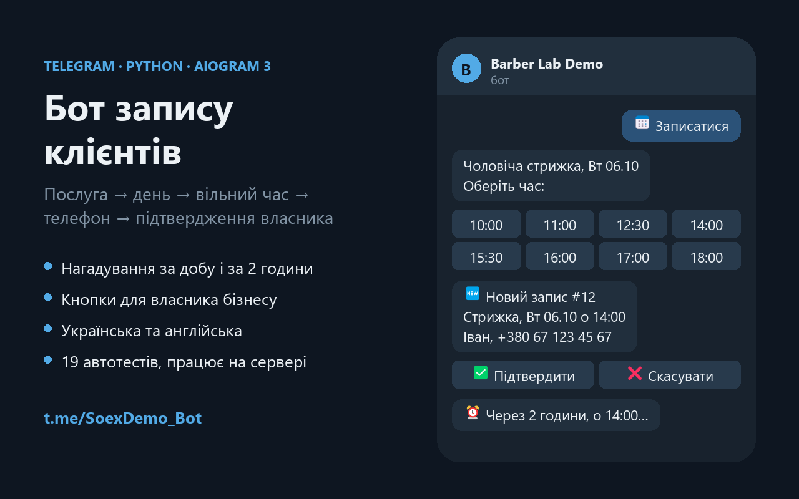

# Booking bot for Telegram



A Telegram bot that takes appointments for a small service business: a barbershop, a nail master, a tutor. Clients pick a service, a day and a free time, and leave a phone number. The owner gets the request with Confirm and Cancel buttons, and the bot reminds the client a day and two hours before the visit.

Written in Python with aiogram 3 and SQLite. Interface in Ukrainian and English.

**Try it:** [@SoexDemo_Bot](https://t.me/SoexDemo_Bot) runs in demo mode, so you see both the client side and the owner side.

## What the client sees

1. 📅 Book → a list of services with duration and price.
2. Days with free time for the next week. Days off and fully booked days are hidden.
3. Free start times for that day. A slot is shown only if the whole service fits before closing and does not overlap another booking.
4. Phone number: one tap on "Share my number", or typed by hand.
5. A summary to check, then the booking is saved.
6. 🗂 My bookings: upcoming visits with status and a cancel button.
7. Reminders 24 hours and 2 hours before the visit. If someone books for later today, the "tomorrow" reminder is skipped.

## What the owner sees

- Every new booking arrives with ✅ Confirm and ❌ Cancel. The client is told about the decision.
- A message when a client cancels.
- `/today` and `/week`: lists of bookings with names and phones.

## Demo mode

With `DEMO_MODE=1` anyone who books also receives a copy of the owner's notification, with working buttons, so a visitor can try both sides in one minute. In this mode `/today` and `/week` show a visitor only their own bookings, so testers never see each other's phone numbers.

## Setup

```bash
python -m venv .venv
.venv/Scripts/pip install -r requirements.txt      # on Linux: .venv/bin/pip
cp .env.example .env                                # then fill in BOT_TOKEN and ADMIN_IDS
python -m bot
```

`BOT_TOKEN` comes from [@BotFather](https://t.me/BotFather). `ADMIN_IDS` is the owner's numeric Telegram ID; several IDs can be separated by commas.

## Configuration

Everything about the business lives in `config.json`, so changing services or hours needs no code:

| Key | Meaning |
|---|---|
| `business_name`, `currency` | Shown to clients, per language |
| `timezone` | Time zone of the business, e.g. `Europe/Kyiv` |
| `work_days` | Working days, 0 = Monday |
| `work_hours` | Opening and closing time |
| `slot_step_min` | How often a booking can start, in minutes |
| `min_lead_min` | How soon from now the earliest booking can be |
| `days_ahead` | How many days ahead clients can book |
| `services` | `id`, name per language, `duration` in minutes, `price` |

## Code

```
bot/
  __main__.py   start-up: settings, database, polling, reminder task
  config.py     .env and config.json
  slots.py      free days, free times, which reminders are due (no Telegram code)
  db.py         SQLite: users and bookings
  handlers.py   client flow, owner buttons, commands
  keyboards.py  keyboards and callback data
  reminders.py  background task, checks once a minute
  texts.py      Ukrainian and English texts
tests/
  test_slots.py  calendar and reminder rules
  test_flow.py   full booking flow run through the real handlers with a fake Telegram session
```

Run the tests with `python -m pytest`.

## Limits

- One master: bookings never overlap. Several masters with separate calendars would be the next step.
- Times are stored in the business time zone. Clients in other zones see the business time.

## License

MIT

## Running on a server

`deploy/tg-booking-bot.service` is a systemd unit: the bot runs as its own system user, can write only to its folder and restarts after a crash or a reboot.

```bash
sudo useradd --system --home-dir /opt/tg-booking-bot --shell /usr/sbin/nologin bookingbot
sudo git clone https://github.com/FrauFeo/telegram-booking-bot.git /opt/tg-booking-bot
sudo python3 -m venv /opt/tg-booking-bot/.venv
sudo /opt/tg-booking-bot/.venv/bin/pip install -r /opt/tg-booking-bot/requirements.txt
sudo install -o bookingbot -g bookingbot -m 600 .env /opt/tg-booking-bot/.env
sudo chown -R bookingbot:bookingbot /opt/tg-booking-bot
sudo cp /opt/tg-booking-bot/deploy/tg-booking-bot.service /etc/systemd/system/
sudo systemctl enable --now tg-booking-bot
```
